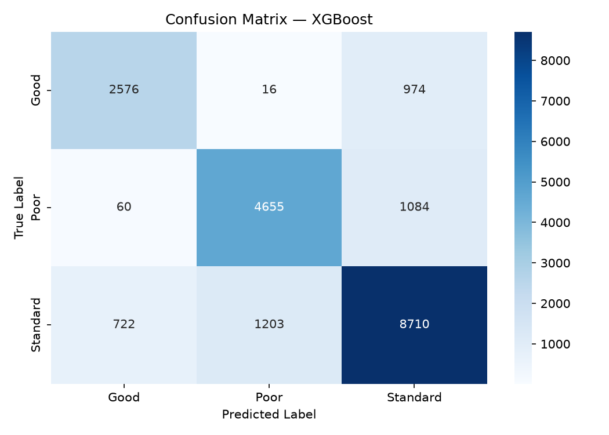
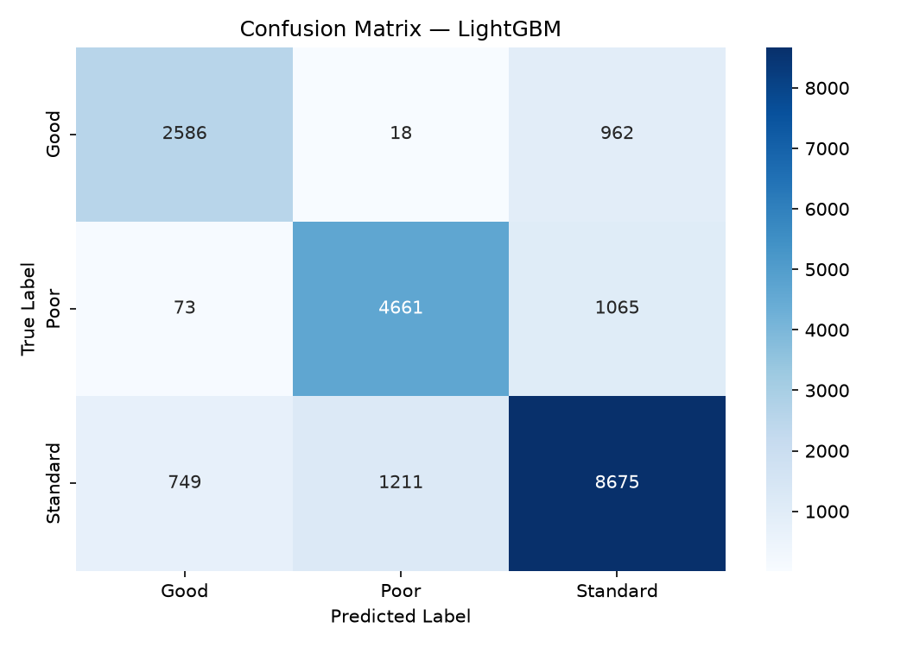

# Credit Score Classification 🏦

Multi-class classification pipeline predicting customer credit score bands
(**Good / Standard / Poor**) using XGBoost and LightGBM, tuned with Optuna,
and tracked with MLflow.

## Project Structure

```
credit_score_project/
├── configs/
│   └── config.yaml           # All settings in one place
├── data/
│   └── train.csv             # Download from Kaggle (not committed)
├── src/
│   ├── data/
│   │   ├── loader.py         # Load raw CSV
│   │   └── cleaner.py        # Fix dirty values, impute nulls
│   ├── features/
│   │   ├── encoder.py        # Label encode target + categoricals
│   │   └── splitter.py       # Stratified train/test split
│   ├── models/
│   │   ├── tuner.py          # Optuna objectives for both models
│   │   ├── xgboost_model.py  # XGBoost build + train
│   │   └── lightgbm_model.py # LightGBM build + train
│   ├── evaluation/
│   │   ├── metrics.py        # Accuracy, F1, per-class F1
│   │   └── visualizer.py     # Confusion matrix plots
│   └── utils/
│       ├── logger.py         # Centralised logging
│       └── mlflow_utils.py   # MLflow helpers
├── tests/
│   ├── test_cleaner.py
│   ├── test_encoder.py
│   └── test_models.py
├── outputs/
│   ├── plots/                # Confusion matrix PNGs
│   └── reports/
├── mlflow_runs/              # Local MLflow tracking store
├── main.py                   # ← Run this
├── requirements.txt
└── .gitignore
```

## Dataset :

- **Source:** [Kaggle — Credit score classification](https://www.kaggle.com/datasets/parisrohan/credit-score-classification/data- **Source:** 


## XGBoost vs LightGBM

| | XGBoost | LightGBM |
|---|---|---|
| Tree growth | Level-wise | Leaf-wise |
| Speed | Slower | Much faster |
| Overfit risk | Lower | Higher (needs regularization) |
| Extra key param | `max_depth` | `num_leaves` |
| Best for | Safer baseline | Large data (like this 100K dataset) |

## MLflow Tracking

Each run logs:
- ✅ Best hyperparameters (from Optuna)
- ✅ Accuracy + Weighted F1 + per-class F1
- ✅ Confusion matrix PNG as artifact
- ✅ Trained model artifact (loadable with `mlflow.xgboost.load_model`)


## 🚀 How to run :
```shell
pip install -r requirements.txt
# drop train.csv into data/
python main.py --trials 30

# view MLflow
mlflow ui --backend-store-uri mlflow_runs

# run tests
pytest tests/
```

## 📊 Results
```text
Model	Accuracy	F1 Weighted
XGBoost	0.7971	0.7967
LightGBM	0.7961	0.7959
```
XGBoost wins — but honestly it's basically a tie, only 0.001 difference.

### Per-class breakdown (XGBoost)
```text
Class	F1
Standard	0.814 — easiest, most data
Poor	0.798 — solid
Good	0.744 — hardest, least data (class imbalance)
```





